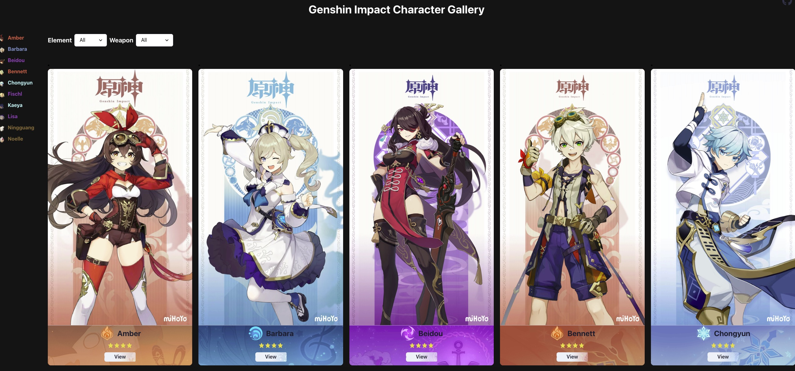

# Genshin-Impact Character Gallery

This repository is based on Typescript, react, vite and chakra-ui. Click link [Genshin-Impact Character Gallery](https://www.bravolu.cn/Genshin-Impact-Character-Gallery) to explore this application.



## Requirement

* npm
* node.js

## Development Environment.

```
$ npm install
$ npm run dev
```

## Production Environment.
```
$ npm run build
```

## Acknowledgment.

1. Meta Data from [GSHIMPACT API](https://gshimpact.vercel.app/)
2. Assets from [wanderer.moe](https://wanderer.moe/genshin-impact) and [Genshin Wiki](https://genshin-impact.fandom.com/wiki/Genshin_Impact_Wiki)
